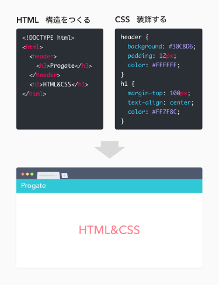

HTML&CSSはWebページを作るために使われる言語です。

インターネット上に公開されているホームページや物販ページ（ECサイト）は、Webサーバー上にHTML&CSSで作成したファイルを置くことで、全世界の皆に公開することが出来ます。
HTMLは文字や画像など表示する対象とその構造を指定する役割があり、表示対象の特性に応じて様々な"タグ"を使用してWebページに表示する構造を記述します。CSSは色やレイアウトなど見た目を装飾する役割を担っており、HTMLで記述した"タグ"要素に対して"プロパティ"で見た目を指定します。

### 学ぶ目的

ホームページやECサイトなど、全てのWebページでHTMLとCSSは使われています。あなたがWebアプリケーションを開発したいと考えているなら、HTML&CSSの知識は必要不可欠です。

HTMLのタグに慣れてきたら、CSSについて学んでみましょう。CSSのプロパティを使いこなすことができれば、様々な画面サイズでの表示に対応した、思い通りの見た目のWebページを作ることができるようになります。

HTML&CSSを一通り使えるようになったら、ポートフォリオサイトなどを作ってあなたが発信したいことや共有したい情報を載せたり、あなたの作った作品を世界に発信してみましょう。

HTML&CSSを学べば、これまであなたの頭の中にあった考えや、誰にも見せたことのなかった作品を、誰もが見える形で表現する手段を手に入れることができるのです。

## 学んでみよう

### 学習の目安

#### 基本
- HTMLとCSSの役割を説明できる
- ボックスモデルでレイアウトを組むことができる
- HTMLのタグの属性やCSSのプロパティを調べて使うことができる
- レスポンシブなページを作ることができる
- HTMLとCSSの役割を説明できる
- 自分で環境を用意して実装することができる

#### 応用
- CSSが適用される優先順位を説明できる
- Webアクセシビリティに対応したページを作れる

### 全体像をつかむには

HTMLの基本的なタグを使って、まずはシンプルなWebページを作成後、CSSファイルでスタイルを定義しどの様に見た目が変わるかを確認します。ブラウザの開発者ツールを使えば、表示レイアウトの確認・修正を簡単に行えます。

レイアウトを組むときは、"ボックスモデル"（縦並びや横並び）について理解しておくと、スムーズにWebページを作ることができます。CSSのプロパティはスタイルを適用するHTMLタグの種類によって結果が変わるものもあるので、その点も意識して学んでいくと良いでしょう。

慣れてきたら「HTML タグ」「HTML 属性」「CSS プロパティ」などで検索し、新しいタグやプロパティをどんどん使ってみましょう！
